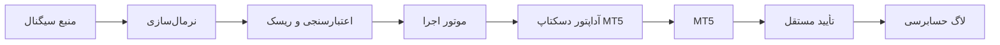

[🇬🇧 English Documentation](README.md)

# Auto Trade — مستندات فارسی

Auto Trade یک پلتفرم اجرای دسکتاپ ویندوز برای MetaTrader 5 است که تولید سیگنال را از اجرای معامله جدا می‌کند. در این مرحله، هسته‌ی ایمن، آزمون‌های شبیه‌سازی‌شده و حالت dry-run ارائه شده‌اند و هیچ سفارش واقعی ارسال نمی‌شود.

> **هشدار ایمنی و انطباق**
>
> معاملات خودکار، اتوماسیون دسکتاپ، اجرای معاملات خارجی و منابع سیگنال ممکن است توسط بروکر، پراپ‌فرم، ارائه‌دهنده حساب یا مقررات قابل اعمال محدود شوند. کاربران مسئول بررسی مجاز بودن کاربرد خود هستند. این پروژه ادعا نمی‌کند که استفاده از رابط دسکتاپ MT5 به‌طور خودکار یک معامله را «دستی» می‌کند یا درباره‌ی سیاست هیچ ارائه‌دهنده‌ای ادعایی دارد.

## ویژگی‌ها

- مدل‌های دامنه‌ی تایپ‌شده برای سیگنال، درخواست، نتیجه، پروفایل ترمینال، محدودیت ریسک و رخداد حسابرسی.
- رابط provider و provider فایل JSON محلی.
- موتور ریسک مستقل با فهرست نمادهای مجاز، حجم، انقضا، نرخ، اتصال و سقف پوزیشن.
- kill switch، محدودیت demo-only، dry-run، جلوگیری از سیگنال تکراری و وضعیت صریح اجرای نامعلوم.
- ماشین حالت اجرا با ثبت ساختاریافته‌ی انتقال‌ها.
- کشف پروسه‌ی MT5 بر اساس مسیر فایل اجرایی و پوشه‌ی داده.
- لاگ حسابرسی JSONL با چرخش فایل.
- CLI برای diagnostics و پردازش dry-run بدون سفارش.
- تست‌های unit و integration که به MT5 واقعی وابسته نیستند.

## معماری



آداپتور واقعی دسکتاپ MT5 در این نسخه عمداً فعال نیست. آداپتور dry-run درخواست را آماده می‌کند، اما کنترل نهایی سفارش را لمس نمی‌کند و پذیرش کارگزار را ادعا نمی‌کند.

## شروع سریع

```powershell
py -3.12 -m venv .venv
.\.venv\Scripts\Activate.ps1
python -m pip install -e ".[dev]"
python -m auto_trade diagnostics
python -m auto_trade test-signal examples\signals\example.json
```

برای dry-run باید زمان سیگنال به‌صورت UTC و به‌روز باشد؛ فایل نمونه ممکن است منقضی شود.

## ایمنی

- حالت dry-run به‌صورت پیش‌فرض فعال است.
- فقط نمادهای مجاز پذیرفته می‌شوند.
- حجم و نرخ اجرا محدود می‌شود.
- سیگنال تکراری و منقضی رد می‌شود.
- kill switch باید پیش از هر اجرا بررسی شود.
- هیچ کلیک یا سفارش واقعی در مسیر فعلی وجود ندارد.

جزئیات در [SAFETY.md](docs/SAFETY.md) و [COMPLIANCE.md](docs/COMPLIANCE.md) آمده است.

## آزمون

- **PASS — mocked:** ۱۵ تست unit و integration اجرا شد.
- **PASS — محیط:** وجود executable، پوشه‌ی داده و پروسه‌ی MT5 تأیید شد.
- **NOT RUN — اجرای واقعی:** هیچ BUY/SELL واقعی انجام نشد.
- **MANUAL TEST REQUIRED:** کنترل‌های UI، DPI، انتخاب نماد و تأیید پوزیشن هنوز باید در demo بررسی شوند.

## مستندات

- [ارزیابی معماری](docs/ARCHITECTURE_ASSESSMENT.md)
- [معماری](docs/ARCHITECTURE.md)
- [پیکربندی](docs/CONFIGURATION.md)
- [پروتکل سیگنال](docs/SIGNAL_PROTOCOL.md)
- [یکپارچه‌سازی MT5](docs/MT5_INTEGRATION.md)
- [توسعه و آزمون](docs/TESTING.md)
- [English documentation](README.md)

## نقشه‌ی راه

مرحله‌ی بعد شامل کشف پنجره و کنترل‌های UI، آماده‌سازی dry-run، تأیید مستقل نتیجه و سپس آزمون کنترل‌شده روی حساب demo است. مسیر اجرای زنده تا زمانی که این کنترل‌ها کامل نشده‌اند مسدود خواهد بود.
