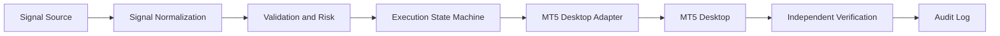

[🇮🇷 مستندات فارسی](README.fa.md)

# Auto Trade

A safety-first Windows desktop execution bridge for MetaTrader 5. The project separates signal generation from desktop execution and currently provides a tested, non-order-producing foundation.

> **Important safety and compliance notice**
>
> Automated trading, desktop automation, external trade execution, and connected signal sources may be restricted by a broker, prop firm, account provider, or applicable terms. Users are responsible for confirming that their intended use is permitted. This project does not claim that using the MT5 desktop interface makes an order “manual,” and it does not make claims about any provider’s policy.

[🇬🇧 English Documentation](README.md)

## Features

- Typed Python domain models for signals, requests, results, terminal profiles, risk limits, and audit events.
- Provider protocol with a local JSON file signal provider.
- Independent risk engine with symbol whitelist, volume, expiration, rate, connection, and position limits.
- Kill switch, demo-only policy, dry-run workflow, duplicate signal protection, and explicit unknown execution state.
- Execution state machine with logged transitions.
- Windows MT5 process discovery using configured executable path and data directory.
- Rotating JSONL audit logging.
- CLI diagnostics and non-executing dry-run processing.
- Mocked unit and integration tests that do not require MT5.

## Architecture



The real MT5 desktop adapter is intentionally not enabled in this first milestone. The dry-run adapter prepares a request but cannot click an order control or claim broker acceptance.

## How It Works

1. A provider receives one explicit signal.
2. The signal is parsed and normalized into `TradeSignal`.
3. The risk engine rejects invalid, expired, duplicate, disallowed, excessive, or rate-limited requests.
4. The workflow records state transitions and prepares the terminal adapter.
5. Dry-run mode stops before any final execution control.
6. A future live adapter must independently verify broker acceptance or a resulting position before reporting success.

A signal, decision, UI click, broker acceptance, and verified position are different events.

## Supported Signal Sources

Implemented: local JSON files.

Planned: authenticated localhost HTTP, WebSocket, named pipes, MT5 bridge, and other providers. No network execution API is currently exposed.

## MT5 Integration

The configured development terminal is:

```text
C:\Program Files\Alpari MT5_2\terminal64.exe
```

The configured data directory is:

```text
C:\Users\BazikadeStore\AppData\Roaming\MetaQuotes\Terminal\AF19ECCF568F855DF9D3196BBF8BF315
```

Only the specified demo terminal should be used for development testing. See [MT5 integration](docs/MT5_INTEGRATION.md) and [safety](docs/SAFETY.md).

## Installation

```powershell
py -3.12 -m venv .venv
.\.venv\Scripts\Activate.ps1
python -m pip install -e ".[dev]"
```

## Quick Start

```powershell
python -m auto_trade diagnostics
python -m auto_trade test-signal examples\signals\example.json
python -m auto_trade dry-run examples\signals\example.json
```

The example is historical and may be rejected as expired. Create a signal with a current UTC timestamp for a dry-run test.

## Demo Mode

Demo-only mode is enabled by default. The current CLI dry-run path does not connect to or place an order in MT5. Real demo order execution is blocked until a terminal adapter and verification strategy pass controlled validation.

## Configuration

Copy `.env.example` to `.env` for local environment variables, or inspect `config/default.yaml`. The runtime currently reads environment variables and uses safe defaults. Never commit credentials.

## Example Signal

```json
{
  "id": "signal-123456",
  "timestamp": "2026-09-25T10:30:00Z",
  "source": "price_action_indicator",
  "symbol": "EURUSD",
  "action": "BUY",
  "volume": 0.10,
  "comment": "PA reversal",
  "strategy": "price_action",
  "metadata": {}
}
```

The complete schema is in [SIGNAL_PROTOCOL.md](docs/SIGNAL_PROTOCOL.md).

## Development

```powershell
python -m pytest -q
ruff check .
mypy src tests
```

## Testing

Current automated status:

- **PASS — mocked:** 15 unit and integration tests executed.
- **PASS — environment:** diagnostics confirmed the configured MT5 executable, data directory, and running process.
- **NOT RUN — real execution:** no real BUY/SELL click or broker order was attempted.
- **MANUAL TEST REQUIRED:** UI control tree, DPI behavior, symbol selection, order dialog, and position verification.

## Documentation

- [Architecture assessment](docs/ARCHITECTURE_ASSESSMENT.md)
- [Architecture](docs/ARCHITECTURE.md)
- [Configuration](docs/CONFIGURATION.md)
- [Signal protocol](docs/SIGNAL_PROTOCOL.md)
- [MT5 integration](docs/MT5_INTEGRATION.md)
- [Safety](docs/SAFETY.md)
- [Compliance](docs/COMPLIANCE.md)
- [Testing](docs/TESTING.md)
- [Persian documentation](README.fa.md)

## Roadmap

See [ROADMAP.md](ROADMAP.md). The next milestones are terminal/window control discovery, dry-run UI preparation, independent verification, controlled demo validation, and only then a guarded live execution path.

## Contributing

Keep changes testable and safety-focused. Run the full test, lint, and type-check commands before proposing changes. See [CONTRIBUTING.md](CONTRIBUTING.md).

## License

This project is provided under the terms in [LICENSE](LICENSE).
