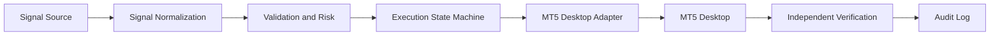

[🇮🇷 مستندات فارسی](README.fa.md)

# Auto Trade

A safety-first Windows desktop execution bridge for MetaTrader 5. The project separates signal generation from desktop execution and provides a guarded, fail-closed UI execution path.

> **Where the project stands:** [docs/STATUS.md](docs/STATUS.md) is the page to
> read first. It records what has been run and observed on a real demo
> terminal, what is refused on purpose, and what is still open with the reason
> each item is open.

> **Important safety and compliance notice**
>
> Automated trading, desktop automation, external trade execution, and connected signal sources may be restricted by a broker, prop firm, account provider, or applicable terms. Users are responsible for confirming that their intended use is permitted. This project does not claim that using the MT5 desktop interface makes an order “manual,” and it does not make claims about any provider’s policy.

[🇬🇧 English Documentation](README.md)

## Features

- Typed Python domain models for signals, requests, results, terminal profiles, risk limits, and audit events.
- Provider protocol with local file, MT5 bridge, and authenticated localhost HTTP, named-pipe, and WebSocket sources.
- Independent risk engine with symbol whitelist, volume, expiration, rate, connection, and position limits.
- Kill switch, demo-only policy, dry-run workflow, duplicate signal protection, and explicit unknown execution state.
- Execution state machine with logged transitions.
- Windows MT5 process discovery using configured executable path and data directory, with the window then selected by the resolved process id. An ambiguous window title is refused rather than resolved.
- Semantic UIA order-dialog preparation with bounded readiness checks and no coordinate-based order controls.
- Position-change verification abstraction with a fail-closed read-only indicator snapshot provider and durable JSON execution ledger for restart-safe idempotency.
- Rotating JSONL audit logging.
- Counters and per-phase latency derived from that audit log, so a run that
  crashed is still measured. See [metrics](docs/METRICS.md).
- Local read-only status dashboard with a durable, token-guarded emergency stop.
- A loopback-only local API for programs, token-authenticated on every route
  including reads, with no endpoint that can place an order. See
  [local API](docs/API.md).
- CLI diagnostics, a zipped diagnostics bundle, a configuration wizard, and
  non-executing dry-run processing.
- Mocked unit and integration tests that do not require MT5.
- A Windows executable and an installer definition, see [packaging](docs/PACKAGING.md).

## Architecture


```mermaid
flowchart LR
    Signal[Signal Source] --> Bridge[Signal Normalization]
    Bridge --> Risk[Validation and Risk]
    Risk --> Engine[Execution State Machine]
    Engine --> Adapter[MT5 Desktop Adapter]
    Adapter --> MT5[MT5 Desktop]
    MT5 --> Verify[Independent Verification]
    Verify --> Audit[Audit Log]
```

The MT5 desktop adapter can inspect the configured demo process/window and validate the active chart symbol, but final execution controls are intentionally blocked. `--mock` remains available for CI without MT5.

## How It Works

1. A provider receives one explicit signal.
2. The signal is parsed and normalized into `TradeSignal`.
3. The risk engine rejects invalid, expired, duplicate, disallowed, excessive, or rate-limited requests.
4. The workflow records state transitions and prepares the terminal adapter.
5. Dry-run mode stops before any final execution control.
6. A future live adapter must independently verify broker acceptance or a resulting position before reporting success.

A signal, decision, UI click, broker acceptance, and verified position are different events.

## Supported Signal Sources

Implemented: local JSON files, MT5 bridge files written by an MQL5 program, and
three authenticated local sources: an HTTP pull, a named pipe, and a loopback
WebSocket. Exactly one source is used per run; two at once are refused. See
[signal protocol](docs/SIGNAL_PROTOCOL.md).

No provider opens a network listener, no provider can place an order, and
`wss` is refused rather than approximated.

## MT5 Integration

The terminal and data directory are machine specific and are configured through
environment variables or a local `.env` file. Copy `.env.example` to `.env` and
point `AUTO_TRADE_TERMINAL_PATH`, `AUTO_TRADE_DATA_PATH` and
`AUTO_TRADE_INSTANCE_NAME` at the demo terminal you intend to use.

`AUTO_TRADE_INSTANCE_NAME` is matched against the window title and fails closed
when it matches nothing, so an ambiguous or unintended terminal is never driven.
Only the specified demo terminal should be used for development testing. See
[MT5 integration](docs/MT5_INTEGRATION.md)
and [safety](docs/SAFETY.md).

## Read-only Position Indicator

The independent observation path is a read-only MQL5 indicator, not a service and not an order sender:

```powershell
.\scripts\install-position-reader.ps1 `
    -DataPath "<MT5 data directory>" `
    -MetaEditor "C:\Program Files\Alpari MT5_2\MetaEditor64.exe"
```

Attach `AutoTradePositionReader` to a chart once. It reads positions and writes a local snapshot; it contains no `OrderSend`, trade request, or custom log. MT5 may still record indicator load/attachment in its own Journal. The attach step is a human action, because MT5's grids and context menus are not exposed to UI Automation; the measured procedure and the validation record are in [demo validation](docs/MT5_DEMO_VALIDATION.md), which records two different terminal builds separately. See [position reader](docs/POSITION_READER.md).

## Installation

```powershell
py -3.12 -m venv .venv
.\.venv\Scripts\Activate.ps1
python -m pip install -e ".[dev,windows]"
```

## Quick Start

```powershell
$env:AUTO_TRADE_ALLOWED_SYMBOLS = "BITCOIN"
python -m auto_trade diagnostics
python -m auto_trade make-signal --symbol BITCOIN --action BUY --volume 0.01
python -m auto_trade test-signal examples\signals\example.json
python -m auto_trade dry-run --mock examples\signals\example.json
python -m auto_trade dry-run examples\signals\example.json
python -m auto_trade position-snapshot
python -m auto_trade execute --confirm-demo <signal-file>
python -m auto_trade close-position <ticket> --confirm-demo
python -m auto_trade recovery
python -m auto_trade reconcile <signal-id> --observed "what you saw"
python -m auto_trade metrics
python -m auto_trade evaluate --symbol BITCOIN
python -m auto_trade fetch-signal
python -m auto_trade diagnostics-bundle
python -m auto_trade dashboard
python -m auto_trade api
python -m auto_trade terminal-check
```

A signal expires at `timestamp + expiration_seconds` unless it carries an explicit
`expiration`, so generate one with `make-signal` rather than editing the example by
hand. `make-signal` also writes the file that the other commands read.

`fetch-signal` needs exactly one source: `AUTO_TRADE_HTTP_SIGNAL_URL`,
`AUTO_TRADE_PIPE_SIGNAL_NAME`, or `AUTO_TRADE_WS_SIGNAL_URL`, each with its
matching token. It performs one authenticated read and writes the returned signal
into the signal directory, where the normal gates still apply.

## Strategy Integration

A market-analysis library plugs in by exposing a strategy: a string `name` and an
`evaluate(context)` method returning a signal or `None`. Copy
`strategies/example_strategy.py`, replace the body, and set
`AUTO_TRADE_STRATEGY=your_module:build`. The library only proposes a trade; it
cannot reach the terminal, the risk engine, or the audit log, and it cannot widen
its own permissions. See [strategy integration](docs/STRATEGY_INTEGRATION.md).

## Execution

The final order control is refused unless `AUTO_TRADE_ENABLE_EXECUTION=true` is
set explicitly. The gate also refuses while dry-run is active, while the kill
switch is engaged, when the demo-only policy is not met, when no observed
baseline exists, and when the prepared dialog no longer matches what the risk
engine approved. A click is recorded as an action only; acceptance is decided by
independent observation. See [execution](docs/EXECUTION.md).

## Dashboard

`python -m auto_trade dashboard` serves a local read-only status page with signal,
execution, risk, position, and log views, plus an emergency stop. It binds
loopback only and refuses any other address, and its mutating endpoints require the
printed control token. It has no endpoint that can place an order. The stop is
written to a file, so it applies to other processes and survives a restart. See
[dashboard](docs/DASHBOARD.md).

## Local API

`python -m auto_trade api` serves the same views to a *program* rather than to a
page. Every route requires a token, reads included, and it binds loopback only.
It has no endpoint that can place, modify, or close an order: the only mutating
routes are the durable stop and its reset, which can only make the system more
conservative. `LocalApiClient` is included so a caller does not re-implement the
authentication and loopback rules. See [local API](docs/API.md).

## Demo Mode

Demo-only mode is enabled by default. The normal CLI dry-run path connects to and inspects the configured demo terminal, validates the active chart symbol, and stops before any final execution control. Use `--mock` for a terminal-independent dry run. Real demo order execution is blocked until verification passes controlled validation.

## Configuration

Copy `.env.example` to `.env` for local environment variables, or inspect `config/default.yaml`. The runtime currently reads environment variables and uses safe defaults. Never commit credentials.

`python -m auto_trade configure` writes a reviewed `.env` for this machine: it
shows the current value as the default of every question, refuses a terminal or
data path that does not exist, keeps settings it does not manage, and writes
`AUTO_TRADE_ENABLE_EXECUTION=false` because it has no answer that can enable a
final execution control. See [packaging](docs/PACKAGING.md).

## Diagnostics Bundle

`python -m auto_trade diagnostics-bundle` writes one zip file with the
environment (including the DPI and monitor facts UI automation depends on), the
configuration, terminal discovery, position observation, execution ledger,
pending signals, kill-switch state, and an audit tail. It is read-only, and a
discovery failure is recorded rather than raised. The bundle contains no
credentials: `.env` is excluded, the HTTP token is reported only as configured or
not, and the endpoint URL is stripped of credentials, query, and fragment. See
[packaging](docs/PACKAGING.md).

## Example Signal

```json
{
  "id": "signal-123456",
  "timestamp": "2026-09-25T10:30:00Z",
  "source": "price_action_indicator",
  "symbol": "EURUSD",
  "action": "BUY",
  "volume": 0.10,
  "comment": "PA reversal",
  "strategy": "price_action",
  "metadata": {}
}
```

The complete schema is in [SIGNAL_PROTOCOL.md](docs/SIGNAL_PROTOCOL.md).

## Development

```powershell
.\scripts\test.ps1
```

That runs `pytest`, `ruff`, and `mypy src tests`, and stops on the first failure.
To run them individually, put `typestubs` on `MYPYPATH` first:

```powershell
$env:MYPYPATH = ".\typestubs"
python -m pytest -q
python -m ruff check .
python -m mypy src tests
```

`typestubs/numpy` exists only to shadow numpy's bundled stubs, which require
Python 3.12 syntax while this project type-checks at 3.11. numpy is never
imported here; without the shadow, `mypy` fails on any machine that happens to
have numpy installed for unrelated reasons.

## Testing

Current automated status:

- **PASS — mocked:** 602 unit and integration tests passed, 1 skipped.
- **PASS — crash between the click and the observation:** the durable record stays pending, a restarted process refuses the same signal without touching the terminal, and only an operator can settle it. See [recovery](docs/RECOVERY.md).
- **PASS — metrics and latency:** counters and per-phase timing, derived from the audit log so a crashed run is still measured. An unmeasured phase reports nothing rather than a zero. See [metrics](docs/METRICS.md).
- **PASS — environment:** Alpari MT5 at a per-user path, its data directory, and the running `Alpari-MT5-Demo` process were found and identified by the project's own discovery, on build 6184 and again on build 6230 with four same-titled terminals running.
- **PASS — indicator build:** `AutoTradePositionReader` compiles with 0 errors and 0 warnings, is registered under Navigator → Indicators, and is attached to a chart. Confirmed on build 6184 and again on build 6230.
- **PASS — position snapshot:** `position-snapshot` reports `AVAILABLE` from a live, complete, advancing snapshot, and the account it describes has no open position. Sequence observed advancing 138 → 273 on 6230.
- **PASS — position observed opening and closing (build 6230):** a position opened by hand was reported with its ticket, symbol, side, and volume, and was gone again from an independent observation after being closed by hand. A snapshot that only ever reported an empty account would have proved nothing. See [demo validation](docs/MT5_DEMO_VALIDATION.md).
- **PASS — staleness guard:** a real snapshot from an earlier session is refused as `stale`, not read as an empty account.
- **PASS — fail-closed before attach (build 6230):** with no snapshot present, `position-snapshot` reported `UNAVAILABLE` with a reason rather than an empty account.
- **PASS — controlled dry-run:** real-terminal BUY and SELL dry-runs on this build reached `ORDER_READY` and closed without a final control, with no position afterwards.
- **PASS — staleness guard on a real old snapshot (build 6230):** four live orders were refused with `refusing to execute: position snapshot is stale (…s old, limit 30s)`, and the terminal journal records no trade for any of them. This is the gate that stopped real orders from being placed against a baseline it could not trust.
- **PASS — guarded demo order (build 6230):** after an earlier attempt was correctly reported `UNKNOWN` because the **broker rejected it** for lack of a network connection, a later attempt returned `ACCEPTED` with `order_reference 383083883` and evidence, and the terminal journal confirms the fill independently. See [demo validation](docs/MT5_DEMO_VALIDATION.md).
- **PASS — close refused for a position this application did not open (build 6230):** a hand-opened ticket was declined with `not in the execution ledger`, and no `position-close` audit event exists, so it refused before touching the UI.
- **PASS — guarded demo order and close, back to back (build 6230):** `execute --confirm-demo` returned `ACCEPTED` with `order_reference 383098717` and evidence, then `close-position --confirm-demo` on the same ticket returned `CLOSED` — `position 383098717 is no longer present in the observed snapshot (1 before, 0 after)` — with no manual step in between. The terminal journal independently confirms both the fill and the close. This is the first time both controls that change an account have been exercised end to end on this build. See [demo validation](docs/MT5_DEMO_VALIDATION.md).
- **PASS — guarded demo order (build 6184):** a real `execute --confirm-demo` on the demo account returned `ACCEPTED` with `order_reference`, an empty baseline, and the observed position in the evidence. The first attempt returned `UNKNOWN` and exposed three post-click defects, all fixed. See [demo validation](docs/MT5_DEMO_VALIDATION.md).
- **PASS — guarded position close (build 6184):** `close-position 382652281 --confirm-demo` returned `CLOSED`, with the ticket gone from an independent observation. Only a position this application opened is closable, and only through the `Close Position` row menu entry. See [execution](docs/EXECUTION.md).
- **NOT RUN — real execution:** no real BUY/SELL click or broker order was attempted.
- **MANUAL TEST REQUIRED:** actual symbol switching, DPI behavior, and broker rejection handling.
- **PASS — dashboard:** loopback-only server with token-guarded mutations and a durable emergency stop.
- **PASS — local API:** every route refuses without a token, reads included; an
  account-changing route is refused with a reason; the durable stop, its reset,
  and their audit records were exercised against a running server. See
  [local API](docs/API.md).
- **PASS — an MT5 update is checked, not discovered by accident:** `terminal-check` probes the live order dialog read-only and reports every control this project measured, filed under the terminal build. On build 6230 it reported `OK` for all 13 controls, so the update moved nothing. It cannot place an order: there is no code path from it to a final control. See [MT5 integration](docs/MT5_INTEGRATION.md).
- **PASS — the right terminal when several are open:** the window is selected by the process id discovery resolved, never by its title. Four of five running terminals shared the title `Alpari-MT5-Demo`; this was a real defect and choosing between same-titled windows is now refused.
- **PASS — executable:** the Windows build runs `diagnostics`, `diagnostics-bundle`, `dry-run --mock`, and the dashboard; built with Python 3.13 here, so rebuild on the 3.12 baseline.
- **NOT RUN — installer:** the Inno Setup definition was never compiled, because Inno Setup is not installed here.

## Documentation

- [Architecture assessment](docs/ARCHITECTURE_ASSESSMENT.md)
- [Project status](docs/STATUS.md)
- [Session summary, 2026-09-28](docs/SESSION_2026-09-28.md)
- [Session summary, 2026-09-29](docs/SESSION_2026-09-29.md)
- [Architecture](docs/ARCHITECTURE.md)
- [Configuration](docs/CONFIGURATION.md)
- [Signal protocol](docs/SIGNAL_PROTOCOL.md)
- [MT5 integration](docs/MT5_INTEGRATION.md)
- [Safety](docs/SAFETY.md)
- [Compliance](docs/COMPLIANCE.md)
- [Testing](docs/TESTING.md)
- [Verification](docs/VERIFICATION.md)
- [Position reader](docs/POSITION_READER.md) · [فارسی](docs/fa/POSITION_READER.md)
- [Dashboard](docs/DASHBOARD.md) · [فارسی](docs/fa/DASHBOARD.md)
- [Security review](docs/SECURITY_REVIEW.md) · [فارسی](docs/fa/SECURITY_REVIEW.md)
- [Local API](docs/API.md) · [فارسی](docs/fa/API.md)
- [Strategy integration](docs/STRATEGY_INTEGRATION.md) · [فارسی](docs/fa/STRATEGY_INTEGRATION.md)
- [Execution](docs/EXECUTION.md) · [فارسی](docs/fa/EXECUTION.md)
- [Traceability inventory](docs/TRACEABILITY.md) · [فارسی](docs/fa/TRACEABILITY.md)
- [Recovery](docs/RECOVERY.md) · [فارسی](docs/fa/RECOVERY.md)
- [Metrics](docs/METRICS.md) · [فارسی](docs/fa/METRICS.md)
- [MT5 demo validation](docs/MT5_DEMO_VALIDATION.md)
- [Packaging](docs/PACKAGING.md)
- [Persian documentation](README.fa.md)

## Roadmap

See [ROADMAP.md](ROADMAP.md). The next milestones are confirming the read-only indicator snapshot on a real demo terminal, observing a demo position opened by hand, and only then a guarded live execution path.

## Contributing

Keep changes testable and safety-focused. Run the full test, lint, and type-check commands before proposing changes. See [CONTRIBUTING.md](CONTRIBUTING.md).

## License

This project is provided under the terms in [LICENSE](LICENSE).
