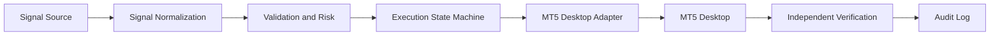

[🇮🇷 مستندات فارسی](README.fa.md)

# Auto Trade

A safety-first Windows desktop execution bridge for MetaTrader 5. The project separates signal generation from desktop execution and currently provides a tested, non-order-producing foundation.

> **Important safety and compliance notice**
>
> Automated trading, desktop automation, external trade execution, and connected signal sources may be restricted by a broker, prop firm, account provider, or applicable terms. Users are responsible for confirming that their intended use is permitted. This project does not claim that using the MT5 desktop interface makes an order “manual,” and it does not make claims about any provider’s policy.

[🇬🇧 English Documentation](README.md)

## Features

- Typed Python domain models for signals, requests, results, terminal profiles, risk limits, and audit events.
- Provider protocol with a local JSON file signal provider.
- Independent risk engine with symbol whitelist, volume, expiration, rate, connection, and position limits.
- Kill switch, demo-only policy, dry-run workflow, duplicate signal protection, and explicit unknown execution state.
- Execution state machine with logged transitions.
- Windows MT5 process discovery using configured executable path and data directory.
- Semantic UIA order-dialog preparation with bounded readiness checks and no coordinate-based order controls.
- Position-change verification abstraction, a fail-closed snapshot provider backed by a read-only MT5 observer service, and durable JSON execution ledger for restart-safe idempotency.
- Rotating JSONL audit logging.
- Local read-only status dashboard with a durable, token-guarded emergency stop.
- CLI diagnostics and non-executing dry-run processing.
- Mocked unit and integration tests that do not require MT5.

## Architecture


```mermaid
flowchart LR
    Signal[Signal Source] --> Bridge[Signal Normalization]
    Bridge --> Risk[Validation and Risk]
    Risk --> Engine[Execution State Machine]
    Engine --> Adapter[MT5 Desktop Adapter]
    Adapter --> MT5[MT5 Desktop]
    MT5 --> Verify[Independent Verification]
    Verify --> Audit[Audit Log]
```

The MT5 desktop adapter can inspect the configured demo process/window and validate the active chart symbol, but final execution controls are intentionally blocked. `--mock` remains available for CI without MT5.

## How It Works

1. A provider receives one explicit signal.
2. The signal is parsed and normalized into `TradeSignal`.
3. The risk engine rejects invalid, expired, duplicate, disallowed, excessive, or rate-limited requests.
4. The workflow records state transitions and prepares the terminal adapter.
5. Dry-run mode stops before any final execution control.
6. A future live adapter must independently verify broker acceptance or a resulting position before reporting success.

A signal, decision, UI click, broker acceptance, and verified position are different events.

## Supported Signal Sources

Implemented: local JSON files.

Planned: authenticated localhost HTTP, WebSocket, named pipes, MT5 bridge, and other providers. No network execution API is currently exposed.

## MT5 Integration

The terminal and data directory are machine specific and are configured through
environment variables or a local `.env` file. Copy `.env.example` to `.env` and
point `AUTO_TRADE_TERMINAL_PATH`, `AUTO_TRADE_DATA_PATH` and
`AUTO_TRADE_INSTANCE_NAME` at the demo terminal you intend to use.

`AUTO_TRADE_INSTANCE_NAME` is matched against the window title and fails closed
when it matches nothing, so an ambiguous or unintended terminal is never driven.
Only the specified demo terminal should be used for development testing. See
[MT5 integration](docs/MT5_INTEGRATION.md), [position observer](docs/POSITION_OBSERVER.md)
and [safety](docs/SAFETY.md).

## Installation

```powershell
py -3.12 -m venv .venv
.\.venv\Scripts\Activate.ps1
python -m pip install -e ".[dev,windows]"
```

## Position Observer

Live execution verification needs an independent read of open positions. Install
the read-only observer and attach it to a chart:

```powershell
.\scripts\install-observer.ps1 -DataPath "<terminal data dir>"
```

Then in the terminal: **Navigator → Expert Advisors → AutoTradePositionObserver**,
then drag it onto a chart or right click → **Attach to Chart**, and confirm with
`OK`. The program contains no order calls of any kind. It is an Expert Advisor, not
an MQL5 Service: the service path does not initialise on this terminal build. See
[position observer](docs/POSITION_OBSERVER.md).

## Quick Start

```powershell
python -m auto_trade diagnostics
python -m auto_trade make-signal --symbol BITCOIN --action BUY --volume 0.01
python -m auto_trade test-signal examples\signals\example.json
python -m auto_trade dry-run --mock examples\signals\example.json
python -m auto_trade dry-run examples\signals\example.json
python -m auto_trade position-snapshot
python -m auto_trade recovery
python -m auto_trade evaluate --symbol BITCOIN
python -m auto_trade dashboard
```

A signal expires at `timestamp + expiration_seconds` unless it carries an explicit
`expiration`, so generate one with `make-signal` rather than editing the example by
hand. `make-signal` also writes the file that the other commands read.

## Strategy Integration

A market-analysis library plugs in by exposing a strategy: a string `name` and an
`evaluate(context)` method returning a signal or `None`. Copy
`strategies/example_strategy.py`, replace the body, and set
`AUTO_TRADE_STRATEGY=your_module:build`. The library only proposes a trade; it
cannot reach the terminal, the risk engine, or the audit log, and it cannot widen
its own permissions. See [strategy integration](docs/STRATEGY_INTEGRATION.md).

## Execution

The final order control is refused unless `AUTO_TRADE_ENABLE_EXECUTION=true` is
set explicitly. The gate also refuses while dry-run is active, while the kill
switch is engaged, when the demo-only policy is not met, when no observed
baseline exists, and when the prepared dialog no longer matches what the risk
engine approved. A click is recorded as an action only; acceptance is decided by
independent observation. See [execution](docs/EXECUTION.md).

## Dashboard

`python -m auto_trade dashboard` serves a local read-only status page with signal,
execution, risk, position, and log views, plus an emergency stop. It binds
loopback only and refuses any other address, and its mutating endpoints require the
printed control token. It has no endpoint that can place an order. The stop is
written to a file, so it applies to other processes and survives a restart. See
[dashboard](docs/DASHBOARD.md).

## Demo Mode

Demo-only mode is enabled by default. The normal CLI dry-run path connects to and inspects the configured demo terminal, validates the active chart symbol, and stops before any final execution control. Use `--mock` for a terminal-independent dry run. Real demo order execution is blocked until verification passes controlled validation.

## Configuration

Copy `.env.example` to `.env` for local environment variables, or inspect `config/default.yaml`. The runtime currently reads environment variables and uses safe defaults. Never commit credentials.

## Example Signal

```json
{
  "id": "signal-123456",
  "timestamp": "2026-09-25T10:30:00Z",
  "source": "price_action_indicator",
  "symbol": "EURUSD",
  "action": "BUY",
  "volume": 0.10,
  "comment": "PA reversal",
  "strategy": "price_action",
  "metadata": {}
}
```

The complete schema is in [SIGNAL_PROTOCOL.md](docs/SIGNAL_PROTOCOL.md).

## Development

```powershell
.\scripts\test.ps1
```

That runs `pytest`, `ruff`, and `mypy src tests`, and stops on the first failure.
To run them individually, put `typestubs` on `MYPYPATH` first:

```powershell
$env:MYPYPATH = ".\typestubs"
python -m pytest -q
python -m ruff check .
python -m mypy src tests
```

`typestubs/numpy` exists only to shadow numpy's bundled stubs, which require
Python 3.12 syntax while this project type-checks at 3.11. numpy is never
imported here; without the shadow, `mypy` fails on any machine that happens to
have numpy installed for unrelated reasons.

## Testing

Current automated status:

- **PASS — mocked:** 106 unit and integration tests executed.
- **PASS — environment:** diagnostics confirmed the configured MT5 executable, data directory, running process, and a unique responsive demo window matching `AUTO_TRADE_INSTANCE_NAME`.
- **PASS — controlled dry-run:** a real-terminal BITCOIN BUY dry-run completed the full state machine to `DRY_RUN_COMPLETED` without a final execution control; the CI mock dry-run also passed.
- **NOT RUN — real execution:** no real BUY/SELL click or broker order was attempted.
- **PASS — semantic preparation:** the real-terminal dry-run opened the semantic order dialog, set Symbol/Volume, and closed it without final execution.
- **MEASURED — UI position reading is not possible:** Trade-grid cell text is empty through UI Automation, Win32 `LVM_GETITEMTEXT`, and MSAA. The grid is owner-drawn.
- **PASS — observer snapshot:** the read-only observer is attached and running; `position-snapshot` and `/api/positions` both return `AVAILABLE` with an empty position list, and the sequence advances once per second.
- **MANUAL TEST REQUIRED:** open a demo position by hand and confirm the snapshot reports it.
- **MANUAL TEST REQUIRED:** actual symbol switching, DPI behavior, and broker rejection handling.
- **PASS — dashboard:** loopback-only server with token-guarded mutations, verified live against this terminal; a stop raised over HTTP blocked a `dry-run` in a separate process.

## Documentation

- [Architecture assessment](docs/ARCHITECTURE_ASSESSMENT.md)
- [Architecture](docs/ARCHITECTURE.md)
- [Configuration](docs/CONFIGURATION.md)
- [Signal protocol](docs/SIGNAL_PROTOCOL.md)
- [MT5 integration](docs/MT5_INTEGRATION.md)
- [Safety](docs/SAFETY.md)
- [Compliance](docs/COMPLIANCE.md)
- [Testing](docs/TESTING.md)
- [Verification](docs/VERIFICATION.md)
- [Position observer](docs/POSITION_OBSERVER.md)
- [Dashboard](docs/DASHBOARD.md)
- [Strategy integration](docs/STRATEGY_INTEGRATION.md)
- [Execution](docs/EXECUTION.md)
- [Traceability inventory](docs/TRACEABILITY.md) · [فارسی](docs/fa/TRACEABILITY.md)
- [Recovery](docs/RECOVERY.md)
- [Persian documentation](README.fa.md)

## Roadmap

See [ROADMAP.md](ROADMAP.md). The next milestones are a reliable independent position observation method, controlled demo rejection tests, and only then a guarded live execution path.

## Contributing

Keep changes testable and safety-focused. Run the full test, lint, and type-check commands before proposing changes. See [CONTRIBUTING.md](CONTRIBUTING.md).

## License

This project is provided under the terms in [LICENSE](LICENSE).
